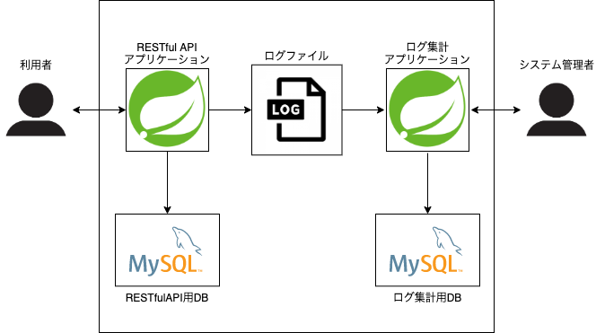
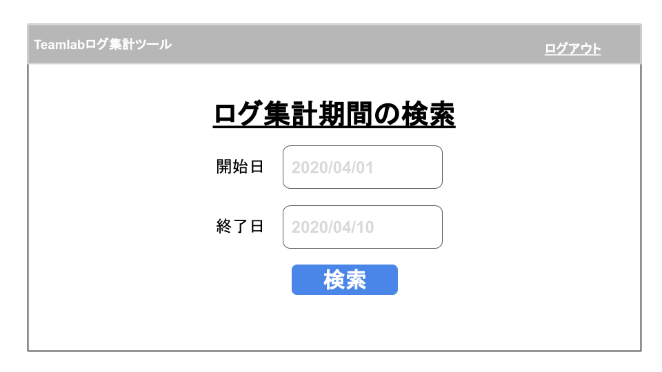
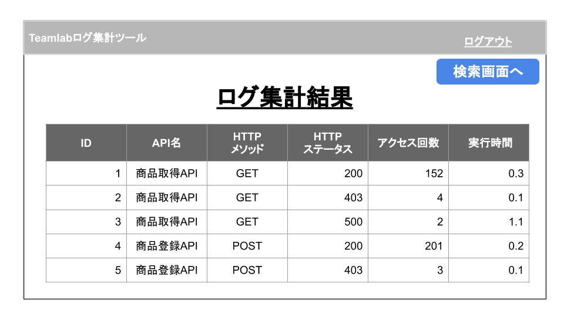

# 詳細設計書

## 目次

- 概要
- 要件
- システム全体構成
- 設計
 - バージョン
 - ページ設計
 - DB設計

## 概要
本システムは基本課題１「RESTfulなAPIアプリケーション」で作成したAPIからのログを画面で確認することを目的として、ログ集計アプリケーションを構築いたします。
ログ集計アプリケーションでは大きく分けて２つのシステムを実装します。１つ目はログ集計の定期実行、２つ目はログ集計結果をWebブラウザから検索、参照できるシステムです。

## 要件
- ログ出力のローテーション設定
- ログ集計を１日１回の定期実行させる実装
- Javaを利用した集計処理の実装
- バッチの進捗状況を管理できるログ出力の実装
- ログ集計の管理画面の実装

## システム全体構成
本システムのシステム構成図を図１に示します。
本システムではwebサーバ、ログ集計の定期実行処理の実装にSpring Frameworkを利用、データの保存はMySQLを利用します。

## 設計
### バージョン
- Spring Boot : 2.2.6.RELEASE
- MySQL : 5.7
- OpenJDK : 11.0.6

### ページ設計
本システムは以下の3ページで構成されます。

|No|ページ論理名|ページ物理名|URL|備考|
|---|---|---|---|---|
|1|ログイン画面|login|/account||
|2|APIログ集計検索画面|search|/log/api||
|3|APIログ集計検索実行画面|execution|/log/api/search||

- ログイン画面

- APIログ集計検索画面

- APIログ集計検索実行画面

### DB設計

#### データベース名
LogManagementSystem

#### テーブル名
|論理名|物理名|ストレージエンジン|備考|
|---|---|---|---|
|ログ集計テーブル|log_summary|InnoDB|charset=utf8mb4|

#### テーブル - log_summary
|PK|論理名|物理名|データ型|長さ|NOT NULL|備考|
|:---:|---|---|---|---:|:---:|---|
|○|ログ集計番号|log_summary_id|INT|10|○|AUTO_INCREMENT|
| |API名|api_name|VARCHAR|256|○||
| |HTTPメソッド|http_method|VARCHAR|256|○||
| |HTTPステータスコード|http_statuscode|VARCHAR|256|○||
| |API実行時間|execution_time|VARCHAR|256|○||
| |APIアクセス数|access_number|INT|10|○||
| |ログ集計日|aggregated_at|DATETIME|-|○||
